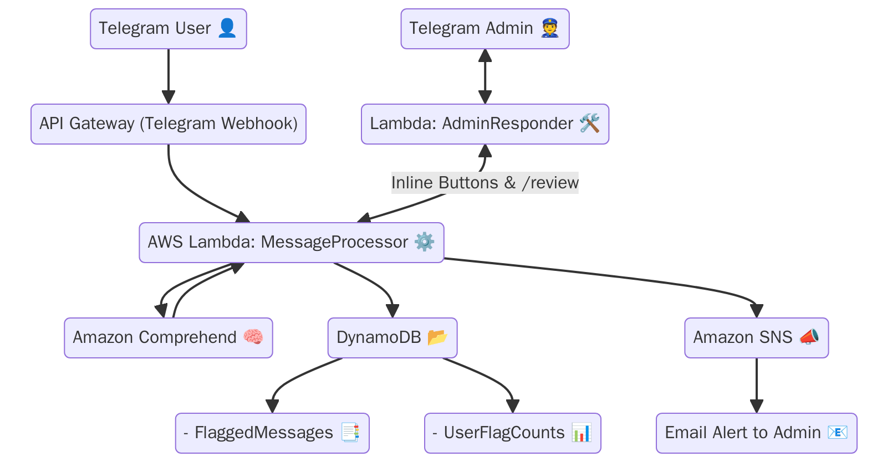
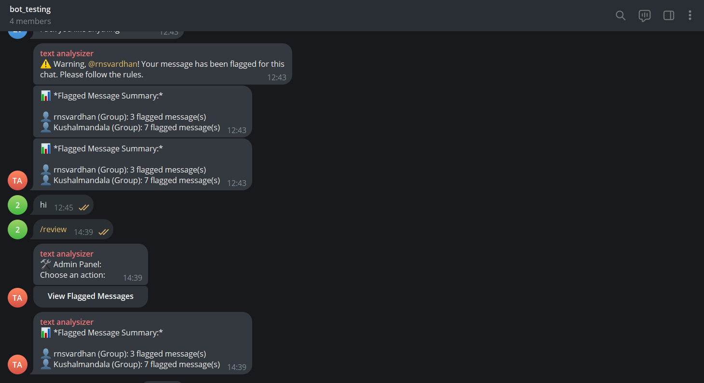
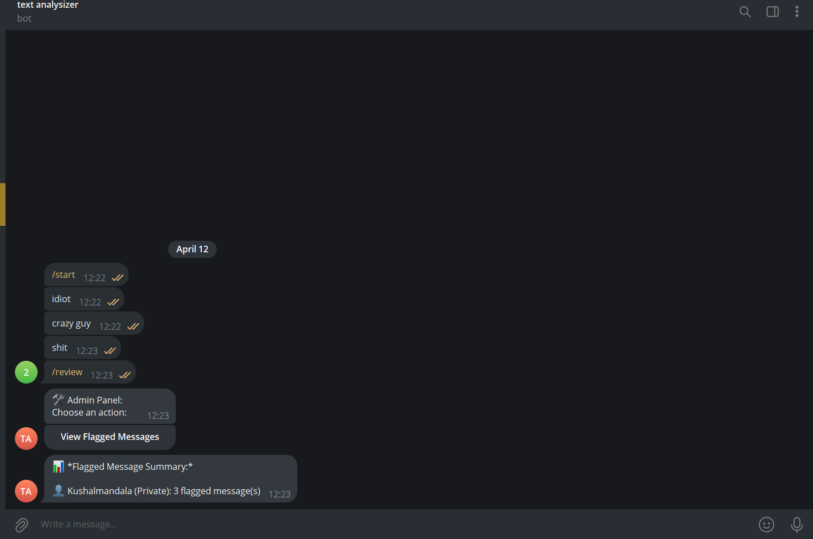

# 🛡️ ToxiTrack – Serverless Telegram Moderator

ToxiTrack is a fully serverless Telegram moderation bot using AWS Lambda, Amazon Comprehend, DynamoDB, and SNS to detect toxic messages and alert admins.

## 📦 Project Structure

- Terraform-based deployment of AWS resources
- Python-based Lambda for Telegram message handling
- Amazon Comprehend for sentiment detection
- Telegram Bot API for user interaction

## 🚀 Deployment with Terraform

### 1. Clone the Repository

```bash
git clone https://github.com/your-username/toxiTrack-telegram-moderator.git
cd toxiTrack-telegram-moderator/terraform
```

### 2. open Lambda Code folder

```bash
cd ../lambda-code

```

### 3. Deploy Infrastructure

```bash
terraform init
terraform apply -var="telegram_bot_token=YOUR_BOT_TOKEN"
```

---

## 🤖 How to Create a Telegram Bot Token

1. Open Telegram and search for [@BotFather](https://t.me/BotFather)
2. Start a chat and type `/newbot`
3. Follow the prompts to name your bot and get the token
4. Copy the token and use it in the Terraform command above

---

## 🧠 AWS Services Used

- **Lambda** – Executes message processing logic
- **DynamoDB** – Stores flagged messages and user history
- **Amazon Comprehend** – Detects message sentiment
- **SNS** – Sends alert notifications
- **IAM** – Role-based permissions for Lambda

---

## 📸 Screenshots

### 🧩 Architecture Overview  
  
*The high-level architecture of ToxiTrack — messages flow from Telegram ➜ API Gateway ➜ Lambda ➜ Sentiment Analysis ➜ Storage & Notification. All components are serverless and auto-scalable.*

---

### 👥 Group Chat Moderation  
  
*This screenshot shows the bot actively monitoring a group chat. Toxic messages are flagged, and the `/review` command allows moderators to view flagged users and take action instantly.*

---

### 🔒 Private Chat Moderation  
  
*ToxiTrack also works in private Telegram chats. Here, a user's message was flagged based on sentiment analysis. The admin is able to view flagged history even in one-on-one conversations.*

---

